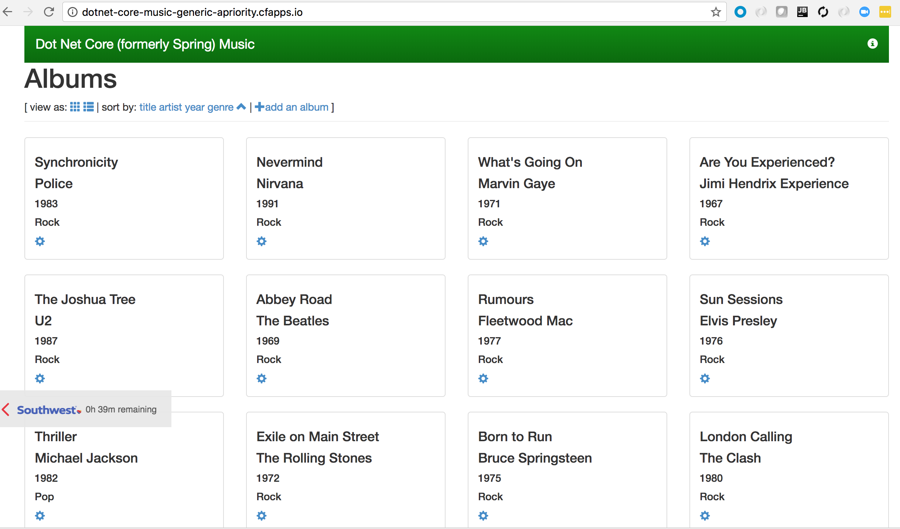
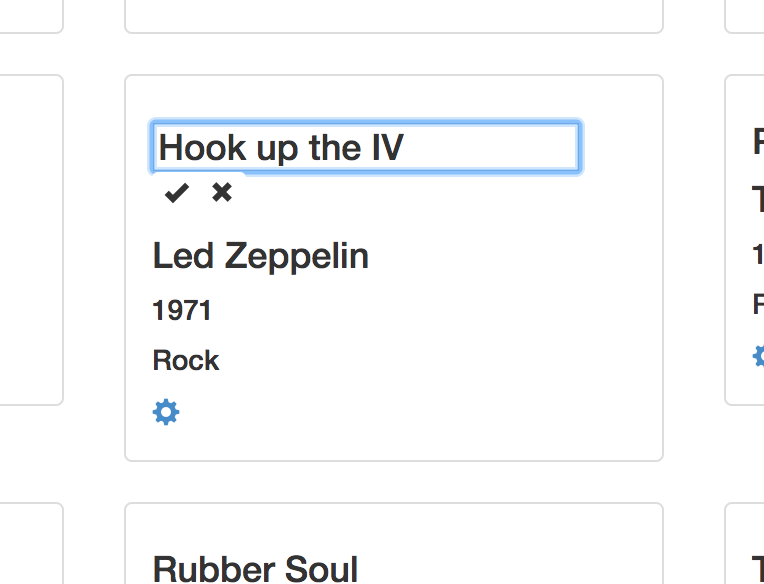

= Lab 1 - Pushing a Ruby Application

== Target the Environment

. Follow the instructions to link:../README.adoc[Get Environment Access]

== Push It!

. Change to the _dotnet-core-cf-sample_app_ application directory:
+
----
$ cd $BOOTCAMP_HOME/dotnet-core-cf-sample-app
----

. Push the application!
+
----
$ cf push
----
+
You should see output similar to the following listing. Take a look at the listing callouts for a play-by-play of what's happening:
+
====
----
Using manifest file /Users/rhardt/workspace/Workshop/dotnet-core-cf-sample-app/manifest.yml <1>

Updating app dotnet-core-cf-sample-app in org DEV / space dev as user@pivotal.io...
OK <2>

Creating route dotnet-core-cf-sample-app-random-phrase.cfapps.io...
OK <3>

Binding dotnet-core-cf-sample-app-random-phrase.cfapps.io to dotnet-core-cf-sample-app...
OK <4>

Uploading dotnet-core-cf-sample-app... <5>
Uploading app files from: /Users/rhardt/workspace/Workshop/dotnet-core-cf-sample-app
Uploading 242.4K, 24 files
Done uploading               
OK

Starting app dotnet-core-cf-sample-app in org DEV / space dev as user@pivotal.io... <6>
Downloading dotnet_core_buildpack...
Downloaded dotnet_core_buildpack
Creating container
Successfully created container
Downloading app package...
Downloaded app package (722.1K)
-----> Dotnet-Core Buildpack version 2.0.4
-----> Supplying Dotnet Core
-----> Installing libunwind 1.2.1
       Copy [/tmp/buildpacks/429f41336d9511a13a93f5e5bd040e6e/dependencies/35a6b4e9cad7a7fe8f8990e063509f7b/libunwind-1.2.1-linux-x64-80af276a.tgz]
       using the default SDK
-----> Installing dotnet 2.1.4 <7>
       Copy [/tmp/buildpacks/429f41336d9511a13a93f5e5bd040e6e/dependencies/fb5682fd7b954b136e426ef05201be7c/dotnet.2.1.4.linux-amd64-684c2e49.tar.xz]
-----> Finalizing Dotnet Core
-----> Restore dotnet dependencies
         Restoring packages for /tmp/app/spring-music-dotnet-core.csproj...
         Restoring packages for /tmp/app/spring-music-dotnet-core.csproj...
         Installing System.Xml.XmlSerializer 4.0.11.   <8>
         Installing System.Globalization.Extensions 4.3.0.
         Installing System.Runtime.Handles 4.3.0.
         Installing System.Threading.Overlapped 4.0.1.
         ...
         Installing System.Globalization.Calendars 4.3.0.
         Installing System.IO.Compression.ZipFile 4.3.0.
         Generating MSBuild file /tmp/app/obj/spring-music-dotnet-core.csproj.nuget.g.props.
         Generating MSBuild file /tmp/app/obj/spring-music-dotnet-core.csproj.nuget.g.targets.
         Restore completed in 11.57 sec for /tmp/app/spring-music-dotnet-core.csproj.
       Required dotnetframework versions: [2.0.0]
-----> Installing dotnet-framework 2.0.0
       Copy [/tmp/buildpacks/429f41336d9511a13a93f5e5bd040e6e/dependencies/c8e245c37838e1b497606c9125af2132/dotnet-framework.2.0.0.linux-amd64-13cb2a76.tar.xz]
       **WARNING** A newer version of dotnet-framework is available in this buildpack. Please adjust your app to use version 2.0.5 instead of version 2.0.0 as soon as possible. Old versions of dotnet-framework are only provided to assist in migrating to newer versions.
-----> Publish dotnet
       Microsoft (R) Build Engine version 15.5.180.51428 for .NET Core
       Copyright (C) Microsoft Corporation. All rights reserved.

         Restoring packages for /tmp/app/spring-music-dotnet-core.csproj...
         Restore completed in 73.55 ms for /tmp/app/spring-music-dotnet-core.csproj.
         Installing runtime.unix.System.Private.Uri 4.3.0.
         Installing System.Private.Uri 4.3.0.
         Installing runtime.ubuntu.14.04-x64.runtime.native.System.Net.Http 4.3.0.
         Installing runtime.ubuntu.14.04-x64.runtime.native.System.IO.Compression 4.3.0.
         ...
         Installing runtime.any.System.Threading.Tasks 4.3.0.
         Installing runtime.any.System.Text.Encoding.Extensions 4.3.0.
         Restore completed in 4.73 sec for /tmp/app/spring-music-dotnet-core.csproj.
         spring-music-dotnet-core -> /tmp/app/bin/Debug/netcoreapp2.0/ubuntu.14.04-x64/spring-music-dotnet-core.dll
         spring-music-dotnet-core -> /tmp/contents142857400/deps/0/dotnet_publish/
-----> Cleaning staging area
       Removing .nuget
       Removing .local
       Removing dotnet
Exit status 0
Uploading droplet, build artifacts cache...   <9>
Uploading build artifacts cache...
Uploading droplet...    
Uploaded build artifacts cache (220B)
Uploaded droplet (39.4M)
Uploading complete
Stopping instance a6841541-fe0d-43f0-8aed-d8db5c5c4127
Destroying container
Successfully destroyed container

1 of 1 instances running

App started

OK

App dotnet-core-music was started using this command `cd ${DEPS_DIR}/0/dotnet_publish && ./spring-music-dotnet-core --server.urls http://0.0.0.0:${PORT}`  <10>

Showing health and status for app dotnet-core-music in org Vertical / space rhardt as rhardt@pivotal.io...
OK

requested state: started
instances: 1/1
usage: 1G x 1 instances
urls: dotnet-core-music-generic-apriority.cfapps.io
last uploaded: Thu Mar 15 01:05:25 UTC 2018
stack: cflinuxfs2
buildpack: dotnet_core_buildpack

     state     since                    cpu    memory        disk           details
#0   running   2018-03-14 06:07:10 PM   0.2%   44.8M of 1G   108.1M of 1G    <11>
----
<1> The CLI is using a manifest to provide necessary configuration details such as application name, memory to be allocated, and path to the application artifact.
Take a look at `manifest.yml` to see how.
<2> In most cases, the CLI indicates each Cloud Foundry API call as it happens.
In this case, the CLI has created an application record for _scale-demo_ in your assigned space.
<3> All HTTP/HTTPS requests to applications will flow through Cloud Foundry's front-end router called http://docs.cloudfoundry.org/concepts/architecture/router.html[(Go)Router].
Here the CLI is creating a route with random word tokens inserted (again, see `manifest.yml` for a hint!) to prevent route collisions across the default `devcloudwest.inbcu.com` domain.
<4> Now the CLI is _binding_ the created route to the application.
Routes can actually be bound to multiple applications to support techniques such as http://www.mattstine.com/2013/07/10/blue-green-deployments-on-cloudfoundry[blue-green deployments].
<5> The CLI finally uploads the application bits to Pivotal Cloud Foundry. Notice that it's uploading _24 files_! This is because Cloud Foundry actually explodes a ZIP artifact before uploading it for caching purposes.
<6> Now we begin the staging process. The https://github.com/cloudfoundry/dotnet-core-buildpack[.NET Core Buildpack] is responsible for assembling the runtime components necessary to run the application.
<7> Here we see the version of the Dotnet Core Framework that has been chosen and installed.
<8> And here we see our apps dependencies that have been discovered and installed.
<9> The complete package of your application and all of its necessary runtime components is called a _droplet_.
Here the droplet is being uploaded to Pivotal Cloudfoundry's internal blobstore so that it can be easily copied to one or more _https://docs.cloudfoundry.org/concepts/diego/diego-architecture.html[Diego Cells]_ for execution.
<10> The CLI tells you exactly what command and argument set was used to start your application.
<11> Finally the CLI reports the current status of your application's health.
====

. Visit the application in your browser by hitting the route that was generated by the CLI:
+

== Interact with App from CF CLI

. Get information about the currently deployed application using CLI apps command:
+
----
$ cf apps
----
+
Note the application name for next steps

. Get information about running instances, memory, CPU, and other statistics using CLI instances command
+
----
$ cf app <<app_name>>
----

. Change some data in the app
+

. Restart the deployed application using the CLI
+
----
$ cf restart <<app_name>>
----

. Visit the app again.  Your changes were lost.  The app uses an in-memory database that gets destroyed and recreated every time the app is restarted.  Furthermore, if you run multiple instances of the app, each will have its own copy of the data.  In the next lab, we'll address this.

== On to the next Lab!
link:../lab2/README.adoc[Lab2 - Bind Data Services]
