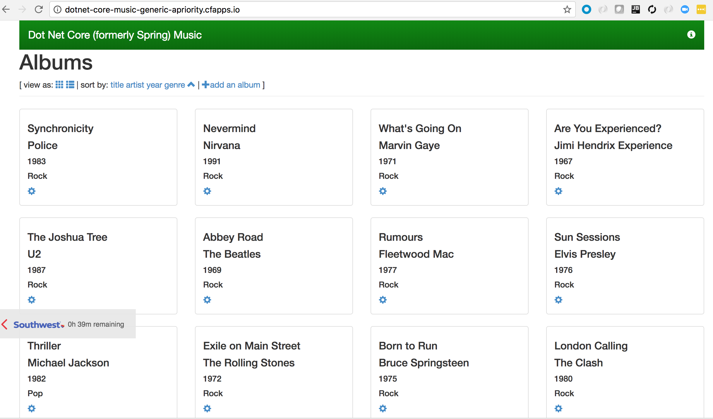
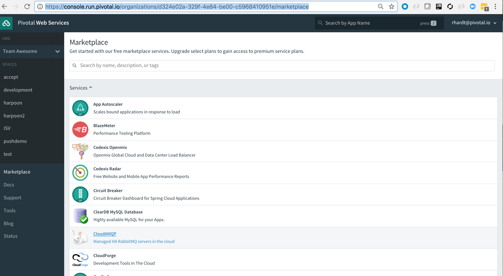
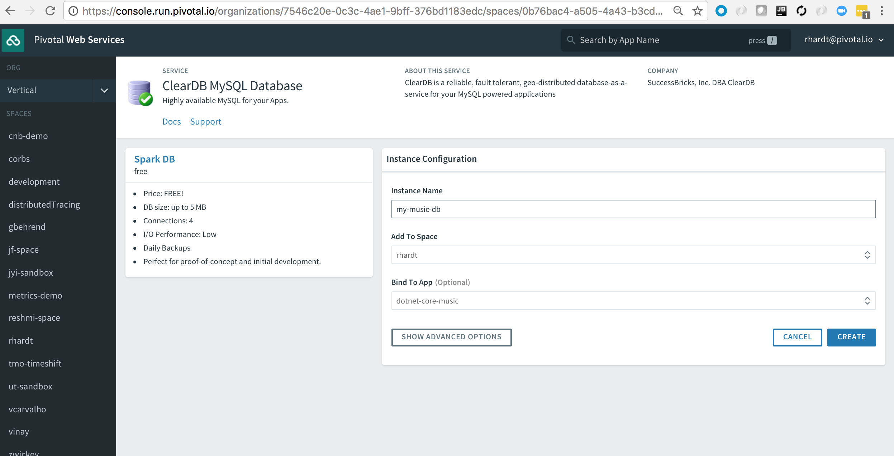
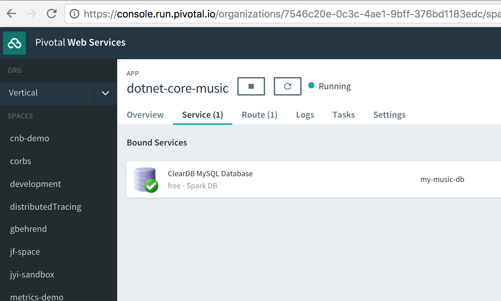

= Lab 2 - Binding to Cloudfoundry Services

[abstract]
--
The _Workshop_ application was designed to illustrate the ease with which data services can be bound to and utilized by applications running on Cloud Foundry.
In this lab, we'll be binding the application to a MySQL databases.

Cloud Foundry services are managed through two primary types of operations:

Create/Delete:: These operations create or delete instances of a service.
For a database this could mean creating/deleting a schema in an existing multitenant cluster or creating/deleting a dedicated database cluster.
Bind/Unbind:: These operations create or delete unique credential sets for an existing service instance that can then be injected into the environment of an application instance.
--

== A Bit of Review

Your instance of the sample _Dotnet Core CF Demo_ should still be running.  Remember that the app data is stored in an ephemeral in-memory database that is local to the container and doesn't survive restarts:

== The Services Marketplace

There are two ways to discover what services are available on Pivotal Cloudfoundry.
The first is available on any instance of Cloud Foundry: the CLI. Just type:

----
$ cf marketplace
----

and you'll get a list of services, their available plans, and descriptions. On Pivotal Cloudfoundry, the ``free'' tier of plans is normally the first one listed.

The second way is specific to Pivotal Cloudfoundry's Apps Manager UI.
If you haven't already, login to it by visiting https://run.pivotal.io

Click on the ''Marketplace'' link:

image::lab1.png[]

and you'll see the same service/plan/description listing in the browser:

== Creating and Binding to a Service Instance

. Let's begin by creating a MySQL service instance.
From the Apps Manager UI service marketplace, select _ClearDB MySQL Database_, select the *Spark DB (Free) Plan*, and provide an instance name.
In the drop-down list next to _Bind to App_ select your dotnet-core-music application.
+

. Notice the admonition to `Use 'cf restage' to ensure your env variable changes take effect`.
Let's take a look at the environment variables for our application. We can do this by bringing up the app's overview page in the Apps Manager UI and selecting the *Settings* tab.
From the *Settings* page click the _Reveal Environment Variables_ link.  Notice the *VCAP_SERVICES* block contains details of your new database instance.

. Now let's _restage_ the application, which cycles our application back through the staging/buildpack process before redeploying the application.footnote:[In this case, we could accomplish the same goal by only _restarting_ the application via `cf restart spring-music`.
A _restage_ is generally recommended because Cloud Foundry buildpacks also have access to injected environment variables and can install or configure things differently based on their values.]
+
----
$ cf restage <your-app-name>
----
+
Once the application is running again, revisit or refresh the browser tab where you have the _Dotnet Core Sample_ application loaded.

. Now, change some data in the application and issue a
+
----
$ cf restart
----
+
Once the application is running again, revisit or refresh the browser tab where you have the _Dotnet Core Sample_ application loaded.
+
You should see that your changes persisted across restarts.  That's because your data is now being stored in the bound MySQL database.

. You may also verify your service was provisioned in the Apps Manager UI by clicking on your application and selecting the _Service(1)_ tab.
+

+
You should now see the service created in step 1 listed.

. You may also verify your service was provisioned using the CLI:
+
----
$ cf services
----
+
You should now see the service created in step 1 listed and your application listed as a bound app.

Congratulations! You have just bound your first Cloud Foundry Service!

== On to the next Lab!
link:../lab3/README.adoc[Lab3 - Operating your Application]
